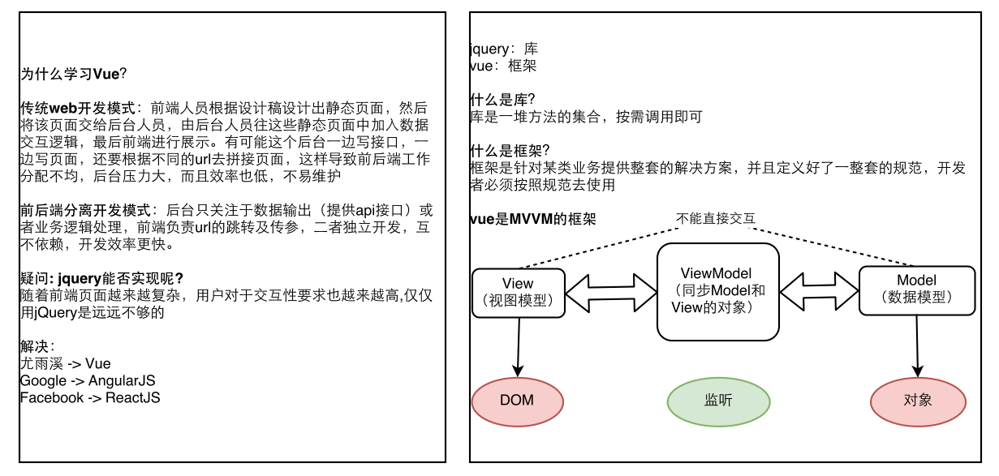
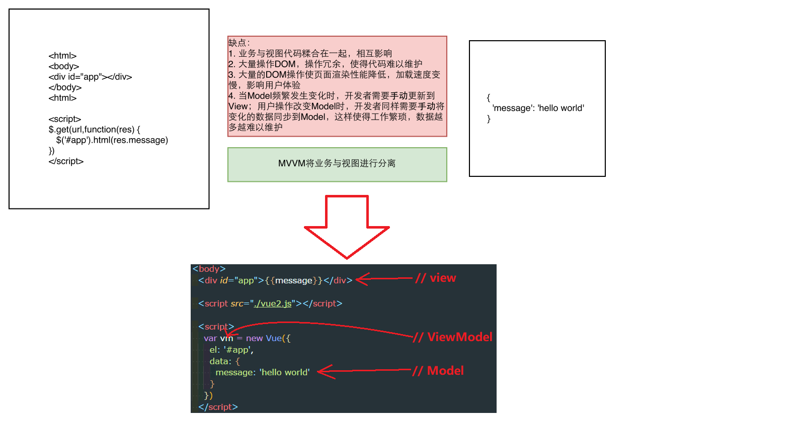
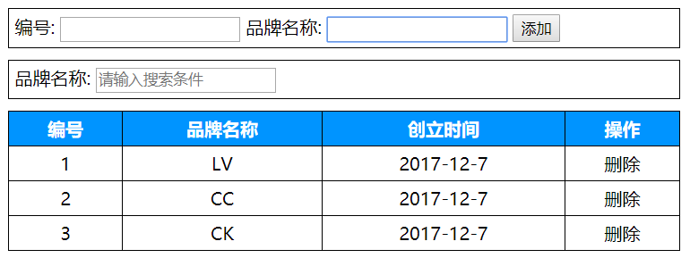
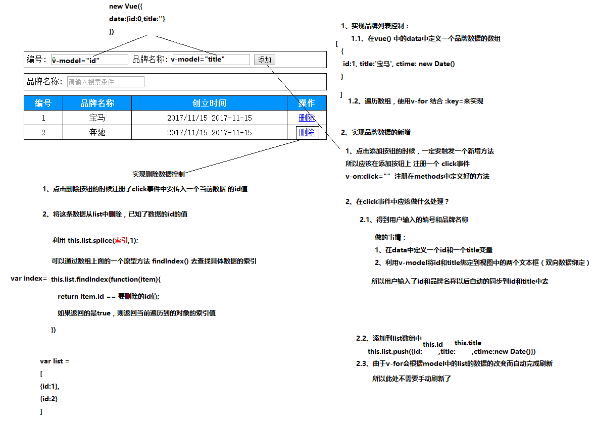
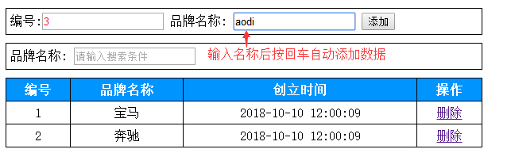

Vue基础-day01
---
<!-- TOC -->

- [课前准备](#课前准备)
  - [浏览器插件](#浏览器插件)
  - [VS Code插件](#vs-code插件)
  - [玩转Vs code](#玩转vs-code)
- [课程介绍](#课程介绍)
  - [为什么学习Vue](#为什么学习vue)
  - [什么是MVVM](#什么是mvvm)
  - [Vue初体验](#vue初体验)
- [Vue常用系统指令](#vue常用系统指令)
  - [插值表达式](#插值表达式)
  - [v-text](#v-text)
  - [v-html](#v-html)
  - [v-bind](#v-bind)
  - [v-for](#v-for)
  - [v-model](#v-model)
  - [v-on](#v-on)
  - [v-on按键修饰符](#v-on按键修饰符)
  - [v-if](#v-if)
  - [v-show](#v-show)
  - [v-cloak](#v-cloak)
- [案例-利用系统指令实现品牌案例管理](#案例-利用系统指令实现品牌案例管理)
  - [目的](#目的)
  - [资源准备](#资源准备)
  - [功能-数据展示实现](#功能-数据展示实现)
  - [功能-数据删除](#功能-数据删除)
  - [功能-数据添加](#功能-数据添加)
  - [功能-按回车键添加数据](#功能-按回车键添加数据)
  - [功能-输入框自动聚焦](#功能-输入框自动聚焦)
  - [ref](#ref)
  - [功能-时间格式化](#功能-时间格式化)
  - [过滤器](#过滤器)

<!-- /TOC -->

## 课前准备

### 浏览器插件

* vue devtools（请到墙外下载）

### VS Code插件

自动补全标签
* Auto Close Tag
* Auto Complete Tag
    * Auto Rename Tag

开启一个服务器浏览HTML网页，第一次使用需要Ctrl + Shift + p输入 live server选择open
* Live Server

路径自动补全
* Path Intellisense

vue语法高亮和自动补全代码
* Vetur
* VueHelper

### 玩转Vs code

* [Vs Code奇淫技巧](https://github.com/Microsoft/vscode-tips-and-tricks)

* Vs Code设置

    文件--->首选项--->设置，然后添加如下代码：

  ```json
      "emmet.syntaxProfiles": {
          "vue-html": "html",
          "vue": "html"
      },
      "emmet.includeLanguages": {
          "vue-html": "html",
          "vue": "html"
      }
  ```
## 课程介绍

### 为什么学习Vue

vue是一套实现了MVVM结构的框架

  库与框架的区别：

框架（framework）好比是已经组装好的电脑，电脑有什么你就用什么

库（library）好比是改装的电脑，想要有什么就改（虽灵活但没框架方便，如jq）


​	

### 什么是MVVM

    - M => Model(数据模型)
    - V => View(视图模型,负责将数据模型转化成UI展现出来，就是那些DOM结构)
    - VM => ViewModel(一个同步View和Model的对象)
    M模型与V视图是互不知道其的存在的，而VM调度model中的数据通过vue特定的指令，将其渲染到视图中，所以vm是modoel与view的一个调度者



### Vue初体验

```html
<!DOCTYPE html>
<html lang="en">
<head>
  <meta charset="UTF-8">
  <meta name="viewport" content="width=device-width, initial-scale=1.0">
  <meta http-equiv="X-UA-Compatible" content="ie=edge">
  <title>Document</title>
  <!-- 1. 引入vue文件 -->
  <script src="./vue2.js"></script>
</head>
<body>
  <!-- 如果超过vue实例的管辖范围，这个{{}}作用就会失效 -->
  <div>{{msg}}</div>
  <div id="app">
    <!-- 5. 展示数据：通过插值表达式{{}} ，作用是专门用来渲染文本-->
    <h1>{{msg}}</h1>
  </div>
  <script>
    // 2. 创建vue实例，作用：他会监管我们的html代码
    var vm = new Vue({
      // 3. 通过一个el属性来指定vue实例的监管范围,后面跟一个id
      el: '#app',
      // 4. 用data属性将要展示的变量存起来,data后面跟一个对象
      data: {
        msg: 'hello world'
      }
    })
  </script>
</body>
</html>
```
## Vue常用系统指令

```
系统指令是vue的一套语法结构，用来将Model中程序员自己定义的数据，按照一定的方式显示在视图中
```

### 插值表达式

```html
    数据绑定最常见的形式，其中最常见的是使用插值表达式，写法是{{}} 中写表达式，定义在文本中,只能使用一条语句完成的表达式，复杂的不行例如if,else if,for等等
    例如：<span>Message: {{ msg }}</span>
    Mustache 标签将会被替代为对应数据对象上 msg 属性（msg定义在data对象中）的值。
    无论何时，绑定的数据对象上 msg 属性发生了改变，插值处的内容都会更新。

    {{}}对JavaScript 表达式支持，例如：
    {{ number + 1 }}
    {{ ok ? 'YES' : 'NO' }}
    {{ message.split('').reverse().join('') }}

    但是有个限制就是，每个绑定都只能包含单个表达式，如下表达式无效：
    <!-- 这是语句，不是表达式 -->
    {{ var a = 1 }}

    <!-- 这也是语句，不是表达式 -->
    {{ number++ }} 会报警告：vue2.js:482 [Vue warn]: You may have an infinite update loop in a component render function.

    <!-- 流控制也不会生效，请使用三元表达式 -->
    {{ if (ok) { return message } }}
```

### v-text

v-text和插值表达式都是显示个文本数据，但它定义在标签中，且不能使用表达式

```html
  <!-- v-text可以将一段文本渲染到指定的元素中,例如： -->
  <div v-text="msg"></div>
  new Vue({
      data:{
          msg:'hello world'
      }
  });

  <!-- 输出结果：-->
  <div>hello world</div>
```

### v-html

```html
  插值表达式和v-text会将数据解释为纯文本，而非 HTML 。
  为了输出真正的 HTML ，你需要使用 v-html 指令，输出html结构（带有dom元素）的数据，例如：
  <div v-html="rawHtml"></div>
      new Vue({
          data:{
              rawHtml:'<h1>hello world</h1>'
          }
  })

  被插入的内容都会被当做 HTML,但是对于没有HTML标签的数据绑定时作用同v-text和{{}}
```

### v-bind

```html
  1、作用：可以给html元素或者组件动态地绑定一个或多个属性（可以是自定义属性），例如动态绑定style和class

  2、举例：
      	  1、img的src从imageSrc变量中取得
          

          2、从classA, classB两个变量的值作为class的值，
          结果是：<div class="A B">classA, classB</div>        
          <div v-bind:class="[classA, classB]">classA, classB</div>
			//数组里的数据代表data中的对应属性值，属性值为样式名
          3、isRed变量如果为true，则class的值为red，否则没有
          <div v-bind:class="{ red: isRed }">isred</div>
			//对象里的数据属性名为样式名，由布尔判断是否出现
          4、div的class属性值一定有classA变量的值，而是否有classB和classC变量的值取决于isB和isC是否为true，二者一一对应
          <div v-bind:class="[classA, { classB: isB, classC: isC }]">数组对象</div>

          5、变量加常量
          <div v-bind:style="{ fontSize: size + 'px' }">size22</div>
		 //涉及到变量和常量要用{}括起来，而变量是在new Vue( )中的 data中定义的
          6、变量加常量的另一种写法
          

          7、对象数组
          <div v-bind:style="[styleObjectA, styleObjectB]">styleObjectA, styleObjectB</div>

  3、缩写形式
      
      <div :class="[classA, classB]">classA, classB</div>
      <div :class="{ red: isRed }">isred</div>
      <div :class="[classA, { classB: isB, classC: isC }]">数组对象</div>
      <div :style="{ fontSize: size + 'px' }">size22</div>
       // v-bind="{绑定的属性名称：'常量'+变量}"
      <div :style="[styleObjectA, styleObjectB]">styleObjectA, styleObjectB</div>


    vue对象初始化
    <script>
      // 实例化vue对象（MVVM中的View Model）
      new Vue({
          // vm控制的区块为id为app的div，此div中的所有vue指令均可以被vm解析
          el:'#app',
          data:{
          // 数据 （MVVM中的Model）   
          imageSrc:'http://157.122.54.189:8998/vue/vuebase/chapter1/imgs/d1-11.png',
          isRed:true,
          classA:'A',
          classB:'B',
          isB:true,
          isC:true,
          size:22,
          styleObjectA:{color:'red'},
          styleObjectB:{fontSize:'30px'}
          },
          methods:{

          }
      })
  </script>
```

### v-for

```html
  <!-- 
    v-for用法：
      item in Array
      (item, index) in Array
		//遍历数组用的

      value in Object
      (value, key, index) in Object
		//遍历对象用的

	item：为遍历的当前数组或者对象的属性值      item为虚拟出来，用于方便遍历的，无下标
	index：代表的是遍历当前数据或者对象的属性的索引
	key：在遍历数组的时候是没有的，在遍历对象的时候代表的是这个对象中的属性名称

    :key属性（此key和上面的key不同）具有唯一性，不能重复，它能够唯一标识数组的每一项
	如果在和v-for的同一标签中使用了:key="xx" （用来匹配遍历的每一个dom元素（一般用id或上面的	index代表，必须是唯一值）），当数据的某一项的值发生改变，重新渲染这个视图的数据时候，只会渲染与当前修改值对应的dom对象中的值，这样能提高刷新效率，在开发过程中一定是配对使用 ，而不是更新整个数据，参考https://www.zhihu.com/question/61064119/answer/183717717

    注意：以下变动不会触发视图更新
      1. 通过索引给数组设置新值
      2. 通过length改变数组
    解决：
      1. Vue.set(arr, index, newValue)
      2. arr.splice(index, 1, newValue)
    -->
    <ul>
      <li v-for="item in user">{{item.name}}</li>
      <li v-for="(item, index) in user" :key="index">{{index}}.{{item.name}}</li>
      <li>---------------华丽的分割线---------------</li>
      <li v-for="value in boss">{{value}}</li>
      <li v-for="(value, key, index) in boss"> {{index}}.{{key}}:{{value}}</li>
    </ul>
    <script>
    var vm = new Vue({
      el: '#app',
      data: {
        user: [
          {name: 'jack'},
          {name: 'neil'},
          {name: 'rose'}
        ],
        boss: {
          name: '马云',
          age: 50,
          money: 1000000002030
        }
      }
    })
    </script>
```

### v-model

```html
  1、在表单控件或者组件上创建双向绑定
  2、v-model仅能在如下元素中使用：
    input
    select
    textarea
    components（Vue中的组件，即在代表组件的标签上使用v-model）

  3、举例：
    <input type="text" v-model="uname" />
	//其实等同于<input type="text" v-bind:value="sth" v-on:input="uname = $event.target.value" />
	//第一行的代码其实只是第二行的语法糖。然后第二行代码还能简写成这样：
<input type="text" :value="sth" @input="sth = $event.target.value" />

  new Vue({
      data:{
          uname:'' //这个属性值和input元素的值相互一一对应，二者任何一个的改变都会联动的改变对方
        }
  })
```

### v-on

```html
  1、作用：绑定事件监听，表达式可以是一个方法的名字或一个内联语句，方法（函数）需要写在new Vue中的methods，如果没有修饰符也可以省略，用在普通的html元素上时，只能监听原生DOM 事件。用在自定义元素组件上时，也可以监听子组件触发的自定义事件。

  2、常用事件（原生的事件均可以用）：
      v-on:click
      v-on:keydown
      v-on:keyup
      v-on:mousedown
      v-on:mouseover
      v-on:submit
      ....
	//一个事件绑定的方法可以带()也可以不带，可以将 $event 传入到某个事件绑定的方法中去
	//$event表示的是你实际触发的元素，不是你事件绑定的元素，事件触发默认是冒泡机制
  3、示例：
    <!-- 方法处理器 -->
    <button v-on:click="doThis"></button>
    <!-- 内联语句 -->
    <button v-on:click="doThat('hello', $event)"></button>
    <!-- 缩写 -->
    <button @click="doThis"></button>
    <!-- 停止冒泡 -->
    <button @click.stop="doThis"></button>
    <!-- 阻止默认行为 -->
    <button @click.prevent="doThis"></button>
    <!-- 阻止默认行为，没有表达式 -->
    <form @submit.prevent></form>
    <!--  串联修饰符 -->
    <button @click.stop.prevent="doThis"></button>
    <!-- 键修饰符，键别名 -->
    <input @keyup.enter="onEnter">
    <!-- 键修饰符，键代码 -->
    <input @keyup.13="onEnter">
    <!-- 点击回调只会触发一次 -->
    <button v-on:click.once="doThis"></button>

   5、v-on的缩写形式：可以使用@替代 v-on:
    <button @click="doThis"></button>


  6、按键修饰符
    触发像keydown这样的按键事件时，可以使用按键修饰符指定按下特殊的键后才触发事件

    写法：
      <input type="text" @keydown.enter="kd1">  当按下回车键时才触发kd1事件

      由于回车键对应的keyCode是13，也可以使用如下替代
      <input type="text" @keydown.13="kd1">  当按下回车键时才触发kd1事件

      但是如果需要按下字母a（对应的keyCode=65）才触发kd1事件，有两种写法：
      1、由于默认不支持a这个按键修饰符，需要Vue.config.keyCodes.a = 65 添加一个对应,所以这种写法为：

      Vue.config.keyCodes.a = 65
      <input type="text" @keydown.a="kd1">  这样即可触发

      2、也可以之间加上a对应的数字65作为按键修饰符
      <input type="text" @keydown.65="kd1">  这样即可触发

      键盘上对应的每个按键可以通过 http://keycode.info/ 获取到当前按下键所对应的数字
```

### v-on按键修饰符

* 作用说明

```html
    文档地址：https://cn.vuejs.org/v2/guide/events.html#键值修饰符

    在监听键盘事件时，我们经常需要监测常见的键值。 Vue 允许为 v-on 在监听键盘事件时添加按键修饰符：
    .enter
    .tab
    .delete (捕获 “删除” 和 “退格” 键)
    .esc
    .space
    .up
    .down
    .left
    .right
```

* 可以自定义按键别名

```html
    // 在Vue2.0版本中扩展一个f1的按键修饰符写法：
    Vue.config.keyCodes.f1 = 112

    // 使用
    <button @keyup.f1="someFunc"></button>
```

### v-if

```html
  1、作用：根据表达式的值的真假条件来决定是否渲染元素，如果条件为false不渲染（达到隐藏元素的目的），为true则渲染。在切换时元素及它的数据绑定被销毁并重建

  2、示例：
    <!-- Handlebars 模板 -->
    {{#if isShow}}
      <h1>Yes</h1>
    {{/if}}

    通常我们使用写法居多：
    <h1 v-if="isShow">Yes</h1>

    也可以用 v-else 添加一个 “else” 块：
    <h1 v-if="isShow">Yes</h1>
    <h1 v-else>No</h1>

    注意：v-else 元素必须紧跟在 v-if 元素否则它不能被识别。

    new Vue({
        data:{
          isShow:true
        }
    });
```

### v-show

```html
  1、特点：dom存在于页面内，已经渲染、事件绑定完毕，区别只是是否显示。根据表达式的真假值，切换元素的 display CSS 属性，如果为false，则在元素上添加 display:none来隐藏元素，否则移除display:none实现显示元素

  2、示例：
      <h1 v-show="isShow">Yes</h1>

      new Vue({
          data:{
            isShow:true
              }
      });

  3、
```

------

```
v-if和v-show的总结：
      v-if和v-show 都能够实现对一个元素的隐藏和显示操作,但是v-if是将这个元素添加或者移除到dom中，而v-show是在这个元素上添加 style="display:none"和移除它来控制元素的显示和隐藏的,
      v-if缺点：耗能大，不适合频繁切换，要考虑渲染页面过快的问题，优点：适合单一页面操作，操作dom元素会简单些
```

### v-cloak

```html
  v-cloak指令保持在元素上直到关联实例结束编译后自动移除，v-cloak和 CSS 规则如 [v-cloak] { display: none } 一起用时，这个指令可以隐藏未编译的 Mustache 标签直到实例准备完毕。
  通常用来防止{{}}表达式闪烁问题（即模板渲染太快，数据渲染没跟上出现的问题）
  例如：
  <style>
  [v-cloak] { display: none }
  </style>

  <!-- 在span上加上 v-cloak和css样式控制以后，浏览器在加载的时候会先把span隐藏起来，知道 Vue实例化完毕以后，才会将v-cloak从span上移除，那么css就会失去作用而将span中的内容呈现给用户 -->
  <span v-cloak>{{msg}}</span>    

  new Vue({
      data:{
          msg:'hello ivan'
        }
  })
```

## 案例-利用系统指令实现品牌案例管理

### 目的

  通过案例熟悉Vue系统指令的用法和结构的写法练习，做到知识点的巩固和学会
  应用，并且在案例的扩展需求中，学习Vue新知识点，做到先有需求，再有知识点
  学习，最后到知识点的应用，让学员学习知识点的同时学会知识点的应用

### 资源准备

*   效果图<br/>

              

*   案例html结构
    ```html
                  <body>
                  <div id="app">
                  <div class="add">
                      编号:<input type="text">
                      品牌名称:<input type="text">
                      <input type="button" value="添加">
                  </div>

                  <div class="add">
                      品牌名称:<input type="text" placeholder="请输入搜索条件">
                  </div>

                  <div>
                      <table class="tb">
                          <tr>
                              <th>编号</th>
                              <th>品牌名称</th>
                              <th>创立时间</th>
                              <th>操作</th>
                          </tr>
                          <tr >
                              <td colspan="4">没有品牌数据</td>
                          </tr>
                      <!-- 动态生成内容tr -->
                      </table>
                  </div>
                  </div>
                  </body>
    ```

    * 案例css样式

    ```html
      <style>

        #app{
            width:600px;
                margin:10px auto;
        }
          .tb{
              border-collapse:collapse;
              width: 100%;
          }
          .tb th{
              background-color: #0094ff;
              color:white;
          }

          .tb td,.tb th{
              padding:5px;
              border:1px solid black;
              text-align: center;
          }

          .add{
              padding: 5px;
              border:1px solid black;
              margin-bottom: 10px;
          }
      </style>
    ```



### 功能-数据展示实现

    1. 在 data 中添加 一个名称为 list的变量，类型为数组,存放品牌数据的对象,格式为:{id:1,name:'宝马',ctime:Date()}

```js
  var vm = new Vue({
    el: '#app',
    data: {
      list: [
        {id: 1, title: 'LV', ctime: new Date()},
        {id: 2, title: 'CC', ctime: new Date()},
        {id: 3, title: 'CK', ctime: new Date()},
      ]
    }
  })
```

    2. 在table中的“动态生成内容tr”位置使用v-for指令遍历list数组数据生成表格内容行，注意要写`:key`

```html
        <tr v-for="(item, index) in list" :key="index">
          <td>{{item.id}}</td>
          <td>{{item.title}}</td>
          <td>{{item.ctime}}</td>
          <td>
            <a href="javascript:void(0)">删除</a>
          </td>
        </tr>
```

    3. 处理 “没有品牌数据” 提示问题,代码如下

```html
利用：v-if进行判断，当list为空时，才显示没有品牌数据

 <tr v-if="list.length==0">
    <td colspan="4">没有品牌数据</td>
</tr>
```

### 功能-数据删除

    1. 给按钮绑定删除方法，并传入一个id

```html
  <a href="javascript:void(0)" @click="deleteData(item.id)">删除</a>
```

    2. Vue实例中定义删除的方法
```js
    methods: {
      deleteData(id) {
        // 返回满足函数条件的数组的项的index
        var index = this.list.findIndex(item => {
          return item.id === id
        })
        // 删除该索引对应的值
        this.list.splice(index, 1)
      }
    }
```

### 功能-数据添加

*   效果图</br>
                  

    1. 实现步骤1：在Vue对象实例的data中添加一个product对象{id:0,name:'',ctime:Date()}

```js
 new Vue({
    el: '#app',
    data: {
        product:{id:0,name:'',ctime:Date()},        
        list:[
            {id:1,name:'宝马',ctime:Date()},
            {id:2,name:'奔驰',ctime:Date()}
        ]
    },
    methods: {      
    }
  })
```

    2. 实现步骤2：在编号和品牌名称文本框中利用v-model对product对象中的id和name属性进行一一绑定 同时在添加按钮上利用 v-on:click注册事件addData

```html
  编号:<input type="text" v-model="product.id">
  品牌名称: <input type="text" v-model="product.name">
  <input type="button" value="添加" @click="addData">
```

    3. 实现步骤3：在Vue对象实例的methods中添加一个 addData的方法实现添加逻辑即可完成

```js
  new Vue({
      // vm控制的区块为id为app的div，此div中的所有vue指令均可以被vm解析
      el: '#app',
      data: {
          product:{id:0,name:'',ctime:Date()},
          list:[
              {id:1,name:'宝马',ctime:Date()},
              {id:2,name:'奔驰',ctime:Date()}
          ]
      },
      methods: {
          addData(){
              // 修改品牌添加时间为当前时间
              this.product.ctime = Date();

              // 添加数据到品牌列表中
              this.list.push(this.product);

              // 清空product
              this.product = {id:0,name:'',ctime:Date()};
          }
      }
  })
```

### 功能-按回车键添加数据

  **关键点：利用v-on的.enter按键修饰符实现，回车键的keycode=13**</br>
  

```html
  品牌名称: <input type="text" v-model="product.name" @keydown.13="addData">

  <!-- 或者 -->
  品牌名称: <input type="text" v-model="product.name" @keydown.enter="addData">
```
### 功能-输入框自动聚焦

  在vue中实现这个需求有三种方式：
*   可以使用document.getElementById()获取到文本框元素对象后调用其focus()方法和设置style属性
*   可以在文本框上元素上增加一个 ref="自定义名称"，再使用this.$refs.自定义名称.focus()和
                    this.$refs.自定义名称.style="color:red" 设置style属性
    * 使用自定义指令实现封装

    > 注意：前两种方式的代码需要写到生命周期事件：mounted(){}中
    
      1. 原生js操作DOM实现（但vue不建议用直接dom操作，违背设计原则，最好用vue的方法实现，用ref）
    
    ```html
      // html代码
      编号:<input type="text" v-model="product.id" id="id">
    
      // vue对象mounted(){}中代码
      mounted(){
          document.getElementById('id').focus();
          document.getElementById('id').style="color:red";
      }
    ```
    
      2. ref方式实现
    
    ```html
      // html代码：
      编号:<input type="text" v-model="product.id" ref="id">
    
      // vue对象mounted(){}中代码
      mounted(){
          this.$refs.id.focus();
          this.$refs.id.style="color:red";
        }
    ```

## 自定义指令

```
3. 使用自定义指令

* 使用说明

  - 利用Vue.directive('指令名称',{inserted:function(el,binding){}})
    指令定义函数提供了几个钩子函数（可选） 

    【bind】

    　　只调用一次，指令第一次绑定到元素时调用，用这个钩子函数可以定义一个在绑定时执行一次的初始化动作

    【inserted】

    　　被绑定元素插入父节点时调用（父节点存在即可调用，不必存在于 document 中）

    【update】

    　　所在组件的 VNode 更新时调用，**但是可能发生在其孩子的 VNode 更新之前**。指令的值可能发生了改变也可能没有。但是可以通过比较更新前后的值来忽略不必要的模板更新

    【componentUpdated】

    　　所在组件的 VNode **及其孩子的 VNode** 全部更新时调用

    【unbind】

    　　只调用一次， 指令与元素解绑时调用
    　　
注意事项：    　　
bind 和 inserted 的相同之处是一上来都执行一次，以后再也不会执行，异同之处在于，bind 拿不到父元素，inserted 可以拿到父元素
update 和 componentUpdated 只有在指令的绑定的值发生更新的时候才会触发调用
update 和 componentUpdated 的区别是：
update 中获取的是更新的之前的指令所在的 DOM 内容
componentUpdated 获取的是更新之后的最新 DOM 内容
update 拿到的是数据改变视图之前的视图内容
componentUpdated 拿到的是数据改变视图之后的视图内容
也就是说如果你需要获取数据改变视图之前的内容，则把代码写到 update 中
如果需要获取数据改变视图之后的内容，则把代码写到 componentUpdated 里面；

  - Vue.directive参数说明
    +   指令名称可由自行定义，注意和系统指令名称有所区别，例如：
                    focus,在某个元素上具体使用的时候请在 指令名称前面再加上v-,例如
                    `<input v-focus>`

    +   第二个参数是一个对象，键值都是一个函数，其中inserted表示 “被绑定元素插入父节点时调用”
        * inserted的参数（钩子函数被赋予了以下参数）：
          - el参数：表示使用此自定义指令的js的dom对象
          - binding参数：一个对象，包含以下属性：
            + name：指令名，不包括 v- 前缀。
            + value：指令的绑定值，例如：v-focus="colorvalue", value 的值是colorvalue这个变量的值，colorvalue定义在data(){}中
            + oldValue: 指令绑定的前一个值，仅在 update 和 componentUpdated 钩子中可用。无论值是否改变都可用。
            + expression：绑定值的字符串形式。例如 v-focus="colorvalue" ，expression 的值是 "colorvalue"
            + arg: 传给指令的参数。例如 v-my-directive:foo， arg 的值是 "foo"。
            + modifiers: 一个包含修饰符的对象。 例如： v-my-directive.foo.bar, 修饰符对象 modifiers 的值是 { foo: true, bar: true }。
         - vnode参数：Vue 编译生成的虚拟节点
         - oldVnode参数：上一个虚拟节点，仅在 `update` 和 `componentUpdated` 钩子中可用

        [注意]除了 `el` 之外，其它参数都是只读的，尽量不要修改他们。如果需要在钩子之间共享数据，建议通过元素的 dataset 来进行

* 开始使用Vue.directive()封装自定义指令v-focus实现光标自动定位

​```html
1、定义指令color
  Vue.directive('color',{
      inserted:function(el,binding){
        //将颜色设置给使用v-color指令的元素上
        el.style.color=binding.value;
      }
  });
​```
```


大多数情况下，可能想在`bind`和`update`钩子上做重复动作，并且不想关心其它的钩子函数。可以这样写：

```
Vue.directive('color-swatch', function (el, binding) {
  el.style.backgroundColor = binding.value
})
```


如果指令需要多个值，可以传入一个JS对象字面量。指令函数能够接受所有合法类型的JS表达式

```
<div v-demo="{ color: 'white', text: 'hello!' }"></div>
```

```
Vue.directive('demo', function (el, binding) {
  console.log(binding.value.color) // => "white"
  console.log(binding.value.text)  // => "hello!"
})
```

 在dom元素上使用指令，注意加上前缀 v-
  编号:<input type="text" v-model="product.id" v-color="colorvalue">

  在Vue对象实例中的data(){}中定义colorvalue
    new Vue({
      data: {
          colorvalue:'red'
      }
    });
  ```

### ref

ref的作用类似于document.getElementByID,在vue中想要获取一个dom对象或者组件对象，则只需要 在此元素上添加一个 ref="自定义名称" ，再使用 this.$refs.自定义名称即可获取

  ```html
  <html>
  <head>
    <script src="vue2.js"></script>
  </head>
    <body>
      <div id="app">
      <span ref="sp"></span>
      </div>
    </body>
    <script>
      new Vue({
        el:'#app',
        methods:{
          getobj:function(){
            //获取到span元素的dom对象，类似于使用document.getElementByID('sp')
            // spanobj就是span的dom对象，可以调用 style,innerHTML,innerText等进行操作
              var spanobj =  this.$refs.sp;              
          }
        }
        })
    </script>
  </html>
  ```

### 功能-时间格式化（采用过滤器）

```html
  // 定义全局过滤器datefmt(过滤器的名称)
  Vue.filter('datefmt',function(input){//全局的是filter，不带s
      var date = new Date(input);
      var year = date.getFullYear();
      var m = date.getMonth() + 1;
      var d = date.getDate();            
      var fmtStr = year+'-'+m +'-'+d;
      return fmtStr; //返回输出结果
  });

  // 调用, 注意datefmt的第一个参数默认就是管道符左边的值
//调用过滤器的方式通常是在 {{数据的键名 | 自定义名称（其他参数）}} 中使用  | （管道符号）来调用  
  <td>{{item.ctime | datefmt }}</td>
```

### 过滤器

私有和公有写法差不多，只是公有是从new vue()里提取出来

    1. 私有过滤器

*   定义方式

                    可以在 new Vue({filters：{}})中的filters中注册一个私有过滤器---//私有的是filter，不带s
        
                    定义格式：
                    new Vue({
                      el:'#app',
                      filters:{        
                          '过滤器名称':function(管道符号|左边对象的值,参数1,参数2,....) {
                            return 对管道符号|左边参数的值做处理以后的值
                          })    
                      }
                      });
                    
                    Vue2.0 调用过滤器传参写法：
                    <span>{{ msg | 过滤器名称('参数1','参数2' ....) }}</span>

*   (应用示例)自定义私有过滤器实现日期格式化

                    ​```html
                      1、 定义私有的日期格式化过滤器：
                      new Vue({
                          el:'#app',
                          data:{
                              time:new Date()
                          },
                          filters:{
                              //定义在 VM中的filters对象中的所有过滤器都是私有过滤器
                              datefmt:function(input,splicchar){
                                  var date = new Date(input);
                                  var year = date.getFullYear();
                                  var m = date.getMonth() + 1;
                                  var d = date.getDate();            
                                  var fmtStr = year+splicchar+m +splicchar+d;
                                  return fmtStr; //返回输出结果
                              }
                          }
                      });
                      2、使用
                      <div id="app">
                        {{ time | datefmt('-') }} //Vue2.0传参写法
                      </div>
                    ​```
              
                ​```
                2.全局过滤器
                ​```

*   定义方式

                      可以用全局方法 Vue.filter() 注册一个全局自定义过滤器，它接收两个参数：过滤器 ID 和过滤器函数。过滤器函数以值为参数，返回转换后的值-----//全局的是filter，不带s
        
                      定义格式：
                      Vue.filter('过滤器名称', function (管道符号|左边参数的值,其他参数1,其他参数2,....) {
                        return 对管道符号|左边参数的值做处理以后的值
                      })
                    
                      Vue2.0 使用：参数调用时用()，多个参数中间使用逗号分开
                      <span>{{ msg | 过滤器名称('参数1','参数2' ....) }}</span>

    * (应用示例)自定义全局过滤器实现日期格式化

      ```html
        1、 定义全局的日期格式化过滤器：
        Vue.filter('datefmt',function(input,splicchar){
            var date = new Date(input);
            var year = date.getFullYear();
            var m = date.getMonth() + 1;
            var d = date.getDate();          
            var fmtStr = year+splicchar+m +splicchar+d;
            return fmtStr; //返回输出结果
        });    

        2、使用
            <div id="app">
              {{ time | datefmt('-') }} //Vue2.0传参写法
            </div>
            
          <script>  
              new Vue({
                  el:'#app1',
                  data:{
                      time:new Date()
                  }
              });
          </script>
      ```
